  

  
  
  
  

<strong>English</strong> · <a href="README_CN.md">简体中文</a>

## ♓ About Me

I have a background in Mathematics and Applied Mathematics and am currently pursuing an MSc in the Department of Computer Science at City University of Hong Kong. My work focuses on two connected tracks: AI products and quantitative systems.

I enjoy turning ambitious ideas into working systems—from zero-to-demo AI products to Python-based factor research. My approach connects technical judgment with product context, rapid experimentation, growth thinking, and clear stakeholder communication.

| AI Products | Quantitative Systems |
| --- | --- |
| Human-centered AI applications, agents, and rapid product prototypes. | Python-based factor research, signal evaluation, and reproducible analysis workflows. |

Across both tracks, I prefer evidence over storytelling alone: define the real problem, build the smallest credible system, test it with real users or measurable signals, and improve it through iteration.

## 🌳 Featured Projects

<table>
  <tr>
    <td>
      <h3><a href="https://www.wozai.space/">Wozai · 我在</a></h3>
      
<b>2nd Place in Track · Hong Kong Physical AI Hackathon · Team Project</b>

      
A relationship-centered AI product for preserving authentic life records and entrusting them to loved ones with consent and restraint—not digital resurrection.

    </td>
  </tr>
  <tr>
    <td>
      <h3><a href="https://omo.space/agentjam">Agent JAM</a></h3>
      
<b>First Prize · Agent Builder Hackathon, Shenzhen · Hosted by StepFun</b>

      
An AI coding collaboration product that brings agent execution, shared project context, and team review into one live workflow.

    </td>
  </tr>
  <tr>
    <td>
      <h3>PandaAI Quant Factor Competition</h3>
      
<b>National Runner-up · Top 1%</b>

      
A Python factor-research workflow for data cleaning, IC / IR signal evaluation, and competition return validation.

    </td>
  </tr>
  <tr>
    <td>
      <h3><a href="https://livelink-delta.vercel.app/">LiveLink</a></h3>
      
<b>30-hour Hackathon Prototype</b>

      
An AI networking product that structures professional identity and helps users discover higher-value connections.

    </td>
  </tr>
  <tr>
    <td>
      <h3><a href="https://github.com/lavine888/bull-bear-exchange-island">Bull &amp; Bear Exchange Island</a></h3>
      
<b>AI-assisted Finance Learning Prototype</b>

      
A game-based product that turns candlesticks, market sentiment, and trading strategies into an explorable learning experience.

    </td>
  </tr>
</table>

## 🛠️ Tech Radar

 

| Layer | What I Work With |
| --- | --- |
| Programming | Python, JavaScript, HTML, CSS, MATLAB, R |
| AI Products | LLM Applications, Agents, NLP, Rapid Prototyping, Demo Design |
| Quantitative Systems | Factor Research, Statistical Modeling, Time Series, IC / IR, Return Validation |
| Workflow | Git, GitHub, Codex, Claude |

## 🎓 Education

* **Master of Science in Computing( Digital commerce)** - Department of Computer Science - [City University of Hong Kong](https://www.cityu.edu.hk/)
* *2025 - present*
* **Bachelor of Science in  Mathematics and Applied Mathematics** - Haide College - [Ocean University of China](https://www.ouc.edu.cn/)
* *2020 - 2024*

## ⚡ Current Direction

- Shipping AI products with clearer user problems, stronger demos, and real feedback.
- Building cleaner quantitative research loops from data preparation to signal evaluation.

## 📫 Contact

Open to AI product, quantitative research, and early-stage collaboration.

[Portfolio](https://lavine-site.vercel.app/) · [lavinexie@foxmail.com](mailto:lavinexie@foxmail.com)
